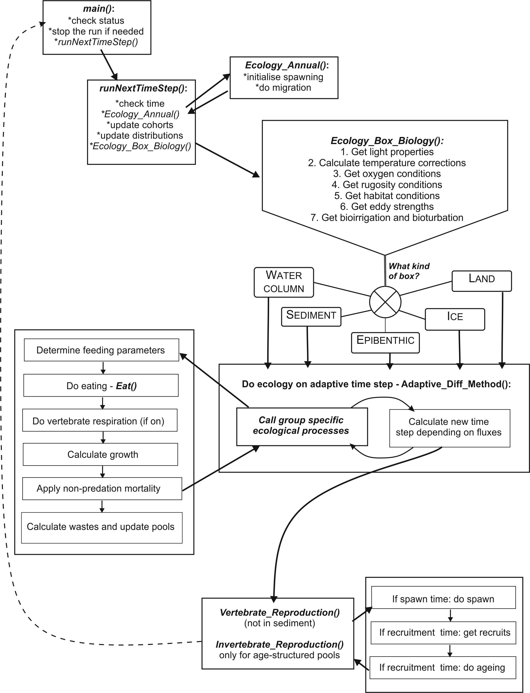

# Final Overview of Ecological Routines {#sec-ecology-overview}

The schematic representation below gives a brief overview of the key ecology routines and the order they are called. The Harvest and socio-economic routines are not included in this representation.

The *main()* routine controls the entire run, and calls the *runNextTimeStep()* if the run should continue (has not been terminated or the last time step has not been reached yet). The *runNextTimeStep()* checks the time of the year and initiaties any relevant annual routines, such as migration or spawning (they are executed later, but the initiation is started here). It then calls the *Ecology_Box_Biology()* routine to run all ecological processes in a given cell. The *Ecology_Box_Biology()* assesses the environmental conditions (light, oxygen, habitat, eddies) and calls for routines that should be executed in each of the five box types: **water column** (not in contact with the sediment layer), **sediment** (not in contact with the water column), **epibenthic** (bottom water layer and top sediment layer), **ice** and **land**. Within each of these boxes Atlantis first runs the main ecological processes, such as feeding, maintenance (if used), growth, nutrient cycling, waste production. These processes are run on an adaptive time step, which means that for the smallest groups (bacteria, phytoplankton) the processes might have to be dynamically repeated many times within a single model timestep (see introduction @sec-functional-groups on adaptive time step). Once these processes are completed, Atlantis then runs the required annual ecology processes, such as reproduction, recruitment and ageing.

The land and ice boxes have only been added recently and are not discussed in details below (the execution of ice is quite similar to the water column, while the land is like the epibenthic layers).

Atlantis runs the water column, sediment or epibenthic processes depending on what kind of interactions are expected (epibenthic processes are run only in the epibenthic boxes). The water column, sediment and epibenthic processes are summarised below.

{width="6.6in" height="8.6in"}

::: {.scroll-frozen style="overflow-x: auto;"}
| Process | N | Si | PB | BB | DL | DR | PP | ZP | MA | BI | PI | VE | MB |
|:--------|:-:|:-:|:-:|:-:|:-:|:-:|:-:|:-:|:-:|:-:|:-:|:-:|:-:|
| **Water column processes** | | | | | | | | | | | | | |
| Used by phytoplankton | + | + | | | | | | | | | | | |
| Used by bacteria | + | | | | + | + | | | | | | | |
| Input from wastes | + | + | | | + | + | | | | | | | |
| Mineralisation | | | + | | + | + | | | | | | | |
| Nitrification | + | | + | | | | | | | | | | |
| Oxygen production | | | | | | | + | | | | | | |
| Nutrient uptake | | | | | | | + | | | | | | |
| Lysis (nutrient stress) | | | | | | | + | | | | | | |
| Feeding | | | + | | | | | + | | | + | + | |
| Growth | | | + | | | | + | + | | | + | + | |
| Respiration | | | | | | | | | | | | (+) | |
| Predation mortality/losses | | | + | | + | + | + | + | | | + | + | |
| Other mortality | | | + | | | | + | + | | | + | + | |
| Waste production | | | + | | | | + | + | | | + | + | |
| **Sediment processes** | | | | | | | | | | | | | |
| Used by microphytobenthos | + | + | | | | | | | | | | | |
| Used by bacteria | + | | | | | | | | | | | | |
| Input from wastes | + | + | | | + | + | | | | | | | |
| Mineralisation | | | | + | + | + | | | | | | | |
| Nitrification | + | | | + | | | | | | | | | |
| Denitrification | + | | | + | | | | | | | | | |
| Oxygen production | | | | | | | | | | | | | + |
| Nutrient uptake | | | | | | | | | | | | | + |
| Feeding | | | | + | | | | | | + | | | |
| Growth | | | | + | | | | | | + | | | + |
| Predation mortality/losses | | | | + | + | + | | | | + | | | + |
| Other mortality | | | | + | | | + | | | + | | | + |
| Waste production | | | | + | | | | | | + | | | |
| Bioturbation/irrigation | | | | | | | | | | + | | | |
| **Epibenthic processes** | | | | | | | | | | | | | |
| Used by macrophytes | + | | | | | | | | | | | | |
| Input from wastes | | | | | + | + | | | | | | | |
| Mineralisation | | | | | + | + | | | | | | | |
| Oxygen production | | | | | | | | | + | | | | |
| Nutrient uptake | | | | | | | | | + | | | | |
| Feeding | | | | | | | | | | + | | | |
| Growth | | | | | | | | | + | + | | | |
| Predation mortality/losses | | | | | + | + | | | + | + | | | |
| Other mortality | | | | | | | | | + | + | | | |
| Waste production | | | | | | | | | | + | | | |
| Bioturbation/irrigation | | | | | | | | | | + | | | |

: List of key ecological processes run in the three main distribution types: water column, sediment, and epibenthic layer. List of the pools tracked in the three types is given in @tbl-state-variables. **Tracer codes:** N = dissolved nitrogen, Si = silicate, PB = pelagic bacteria, BB = benthic bacteria, DL = labile detritus, DR = refractory detritus. **Organism codes:** PP = phytoplankton (including dinoflagellates), ZP = zooplankton, MA = macroalgae and seagrasses, BI = benthic invertebrates, PI = cephalopods and prawns (nektonic pelagic invertebrates), VE = vertebrates, MB = microphytobenthos. {#tbl-ecological-processes}
:::

::: {.scroll-frozen style="overflow-x: auto;"}
| Feature | Assumptions and/or formulation notes |
|:--------|:-------------------------------------|
| **General features** | |
| Biomass units | mg N/m³ |
| Input forcing | nutrients, temperature and physics on interannual, seasonal, tidal frequencies |
| Level of group detail | functional group (with a small number of individual species) |
| Resolution of the formulation used for the biomass pool groups | follow the dynamics of the entire biomass pool of the functional group (or species) in the cell |
| Resolution of the formulation used for the age structured groups | follow the biomass dynamics (structural and reserve weight) of the 'average individual' for the functional group (or species) in the cell and the number of individuals in the cell |
| Timestep | adaptive\* daily or diurnal time step |
| **Process related** | |
| Bioturbation and bioirrigation | yes, simple exchange between layers |
| Consumption formulation | type II (asymptotic), with an availability parameter which can be habitat dependent |
| Equations | five general sets of rate of change equations used (autotrophs, biomass pool and age structured consumer, bacteria, inanimate) |
| Formulation detail | general: only growth, mortality and excretion explicit |
| Light limitation | optimal irradiance fixed |
| Mixotrophy | yes, for dinoflagellates (if present) |
| Nutrient limitation | external nutrients determine uptake |
| Nutrient ratio | Redfield |
| Oxygen limitation | yes |
| Sediment burial | very low background rate included |
| Sediment chemistry | dynamic, with sediment bacteria |
| Shading of primary producers | yes |
| Spatial (or habitat) limitation | yes (for benthic or demersal groups (and species)) |
| Spatial structure | flexible with the potential for multiple vertical and horizontal cells |
| Temperature dependency | yes |
| Transport model used for hydrodynamics flows | yes |
| **Model closure** | |
| Top predators represented by static loss terms | some top predators are included explicitly, but predators not explicitly included in the foodweb are represented using quadratic mortality terms |
| Mortality terms | linear and quadratic |
| **Vertebrate and fisheries related** | |
| Age structure | multiple age classes (or stages, which equate to life phases), with final age class of each group a "plus group" |
| Fishery discards | target and bycatch groups (and species) |
| Incidental mortality due to fishing | yes |
| Biomass pool fisheries | yes |
| Management | variable, may be via effort limitations, gear limitations, minimum legal size, area or temporal closures and may be based on target or endangered stocks |
| Stock-recruit relationship | Beverton-Holt, productivity-based or constant recruitment |
| Stock structure | depends on recruitment function chosen — may be internal (all the stock within the bay and self-seeds) or external (the reproductive stock outside the bay produces the recruits and the oldest age classes migrate out of the bay to join this stock) |

: Basic assumptions and formulations in the Atlantis model (modified after Fulton et al. 2004b). {#tbl-atlantis-assumptions tbl-colwidths=[35,65]}
:::